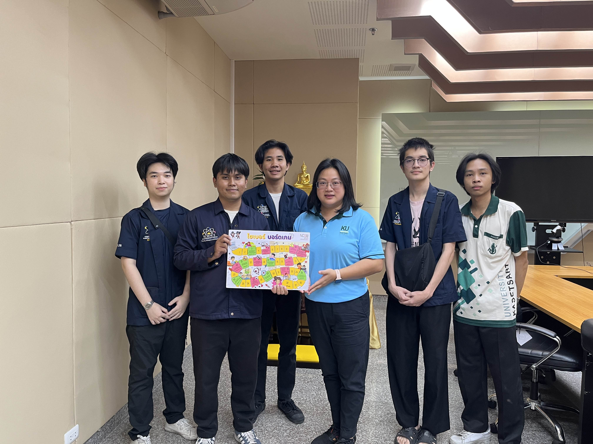
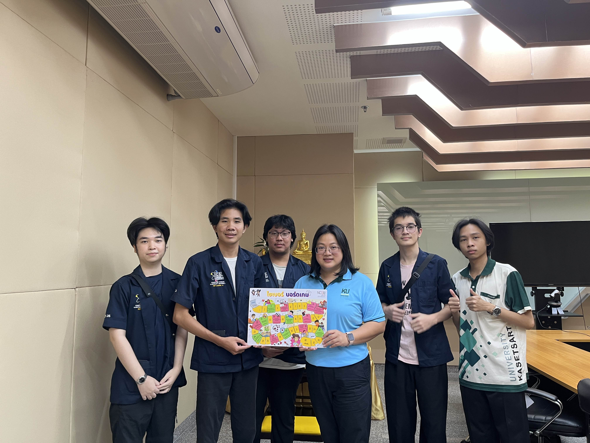
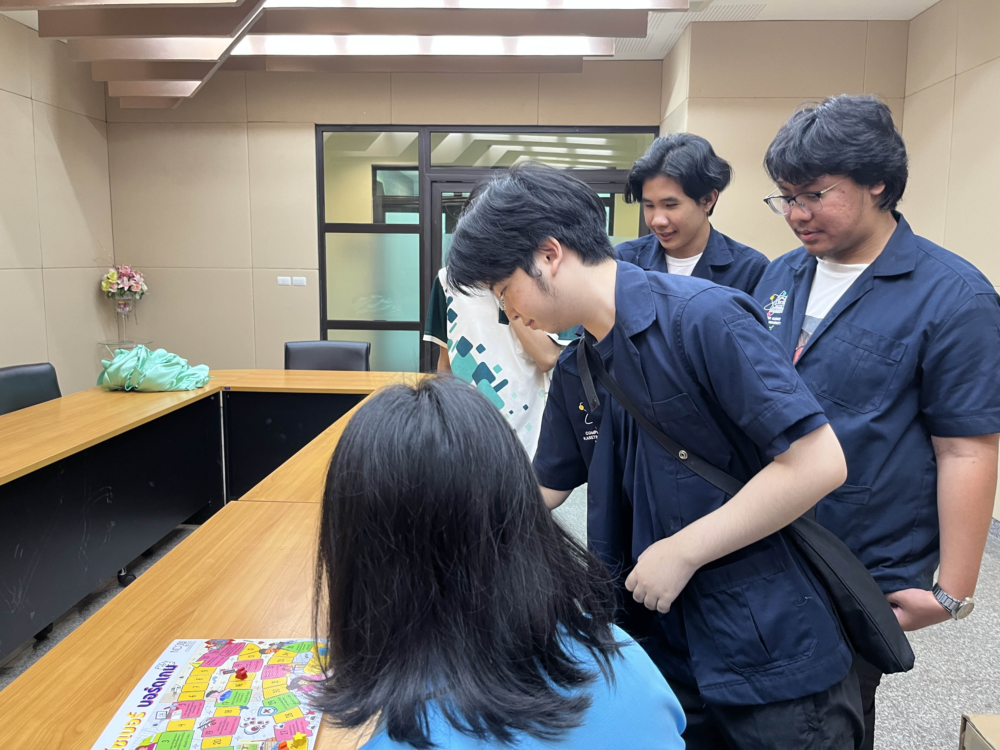
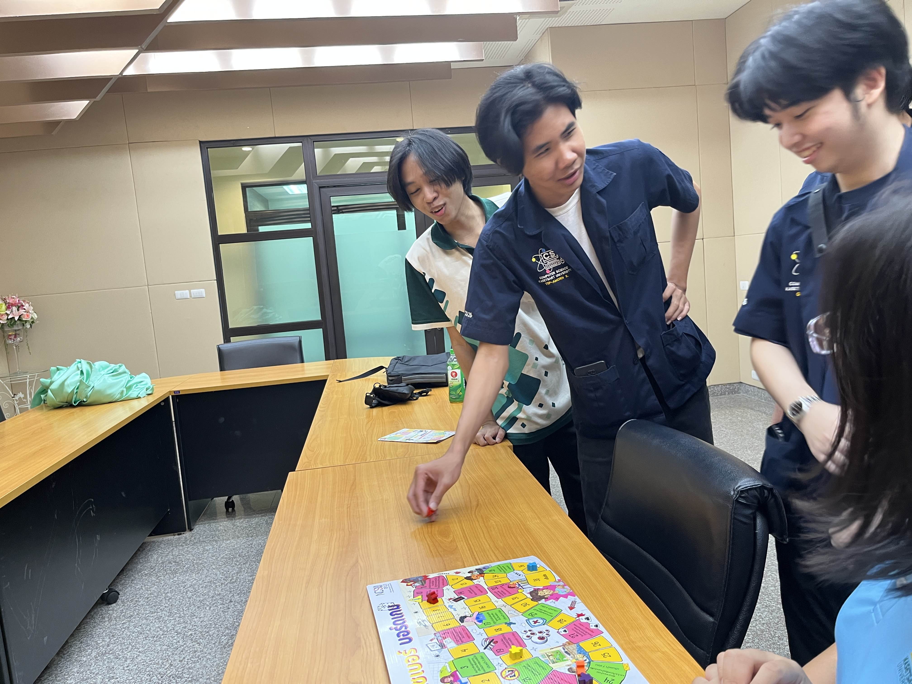
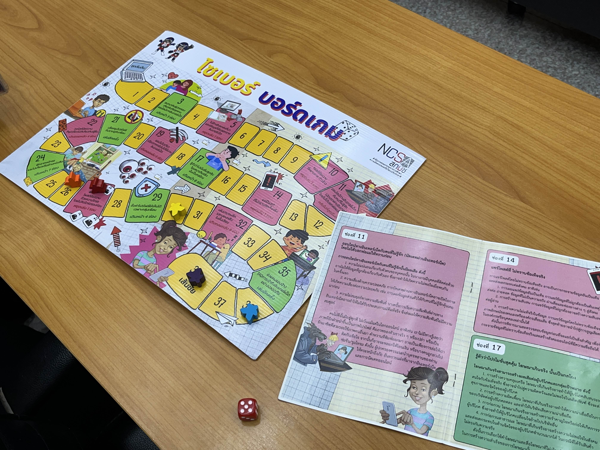

# NCSA Boardgame Challenge with lnwza007 Group 🥷💥  

[ Back to Homepage ](https://srchx.github.io)  

**🤖 Securing Human Topic in Information System Security 🎲**

**Introduction 📝**  
สำนักงานคณะกรรมการการรักษาความมั่นคงปลอดภัยไซเบอร์แห่งชาติ (NCSA) ได้จัดกิจกรรมบอร์ดเกมเพื่อเสริมสร้างความรู้ด้านความปลอดภัยไซเบอร์ โดยตัวบอร์ดเกมถูกออกแบบให้ผสมผสานความรู้ด้าน Cybersecurity ผ่านกลไกเกมที่น่าสนใจ ช่วยให้ผู้เล่นเรียนรู้แนวทางป้องกันภัยคุกคามทางไซเบอร์ในบรรยากาศที่สนุกสนาน

**Date 📆**  
31 January 2025

**location 📍**  
อาคาร 26 ชั้น 2 ห้องประชุม

**Target Audience 👩🏻‍💼**  
คุณ ธัญกัญจน์ ณัฐรมย์สิริ (บุคลากร | งานบริการและพัฒนาคุณภาพการศึกษา)

**Purpose of the activity 🎯**  
เป้าหมายของกิจกรรมบอร์ดเกมเพื่อความปลอดภัยไซเบอร์คือการเสริมสร้างความรู้และความเข้าใจด้าน Cybersecurity ผ่านการเรียนรู้เชิงสร้างสรรค์ในรูปแบบเกม ผู้เข้าร่วมจะได้ตระหนักถึงความสำคัญของการป้องกันภัยคุกคามทางไซเบอร์ พร้อมทั้งพัฒนาทักษะการคิดวิเคราะห์และการตัดสินใจผ่านสถานการณ์จำลอง นอกจากนี้ กิจกรรมยังช่วยกระตุ้นความสนใจให้ผู้เข้าร่วมศึกษาหรือปฏิบัติตามแนวทางความปลอดภัยไซเบอร์ในชีวิตจริง

**Activity Pictures 🖼️**  

**Activity Video 🎥**  

**Group 🤼** 
- [1. Chayanon Pansanguan](https://plantzaza.github.io/board-game) 
- [2. Tep-Amorn Singkornkiew](https://tepamorn.github.io/board-game) 
- [3. Guyyasit Limswangwong](https://guyyasit336.github.io/board-game) 
- [4. Witphon Inaksorn](https://witchapolinaksorn.github.io/board-game) 
- [5. Surachat Keandee](https://srchx.github.io/board-game) 
- [6. Phatsagon Teerarujinon](https://phatsagon.github.io/board-game)
